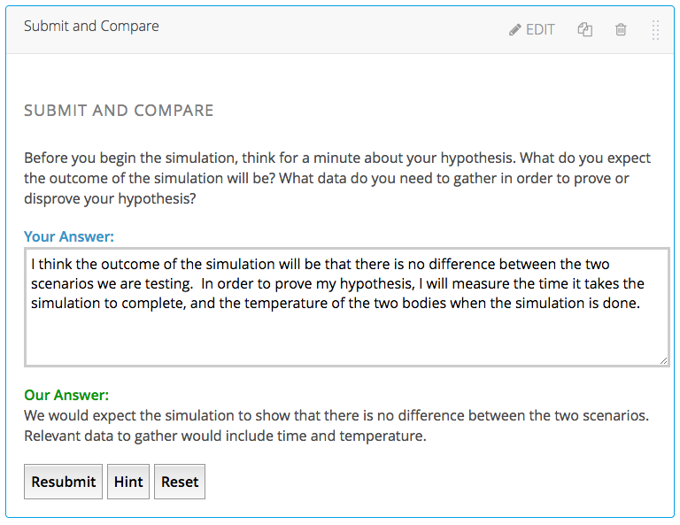
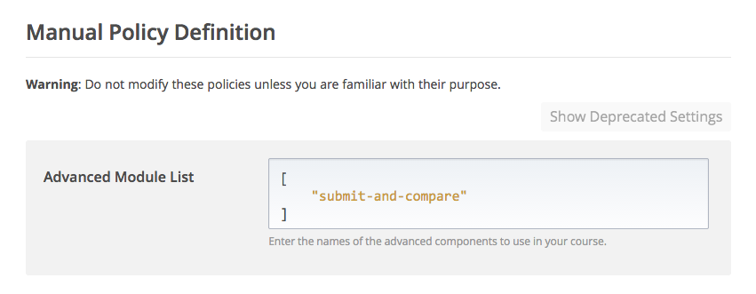
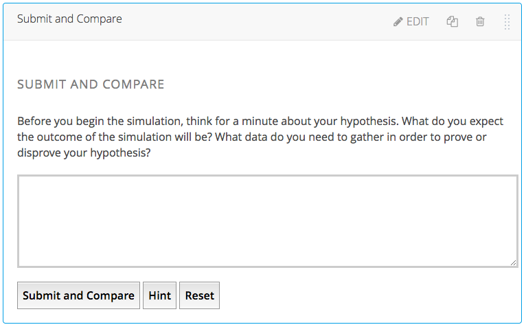
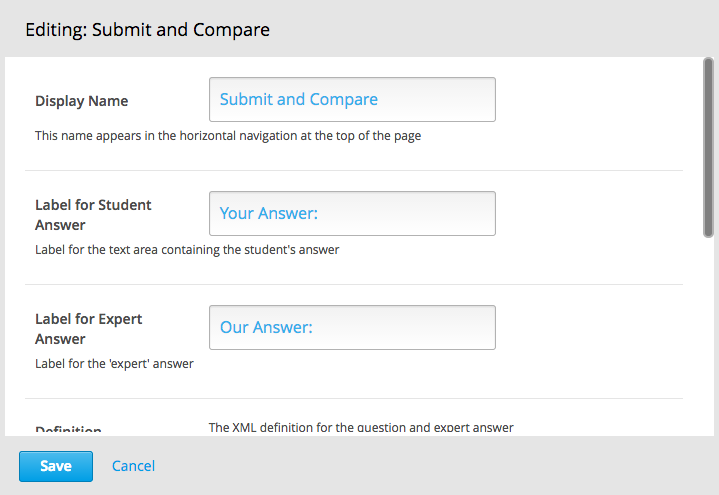

Submit and Compare XBlock
=========================
This XBlock provides a way to do an ungraded self assessment activity.  It is useful for synthesis questions, or questions which require the student to answer in her own words.  After the student submits her answer, she is able to see the instructor's answer, and compare her answer to the expert answer.



Installation
------------
To install the Submit and Compare XBlock within your edX python environment, simply run this command:

```bash
$ pip install -r requirements.txt
```

Enabling in Studio
------------------
Go to `Settings -> Advanced Settings` and set `Advanced Module List` to `["submit-and-compare"]`.



Usage
------------------
Once the Submit and Compare XBlock is enabled in Studio, you should see it a new Component button labeled `Advanced`:


Click the `Advanced` button and you should see the Submit and Compare XBlock listed:


After you've selected the Submit and Compare XBlock, a default question will be inserted into your unit:



Customization
-------------
The question and expert answer can both be customized by clicking the `Edit` button on the component:




The Submit and Compare XBlock uses a simple XML-based structure as shown below:
```bash
<submit_and_compare schema_version='1'>
	<body>Insert the question here.  You can include html tags like <p>, , etc.</body>
	<explanation>Insert the expert answer here.  You can include html tags like <p>, , etc.</explanation>
	<demandhint>
		<hint>Here you can include hints for the student</hint>
		<hint>Here is another hint</hint>
	</demandhint>
</submit_and_compare>
```

